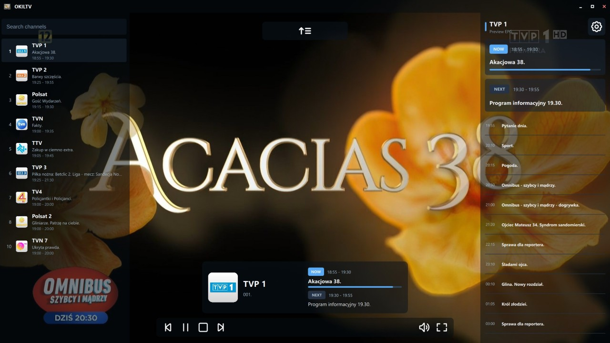
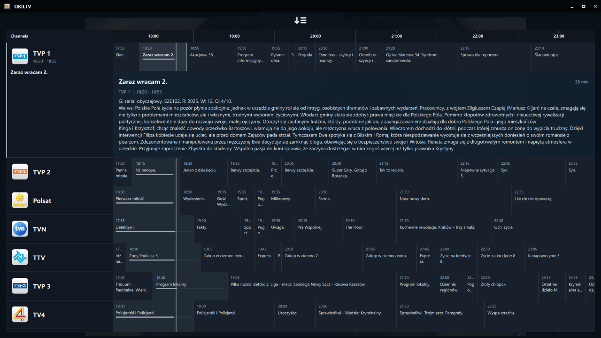
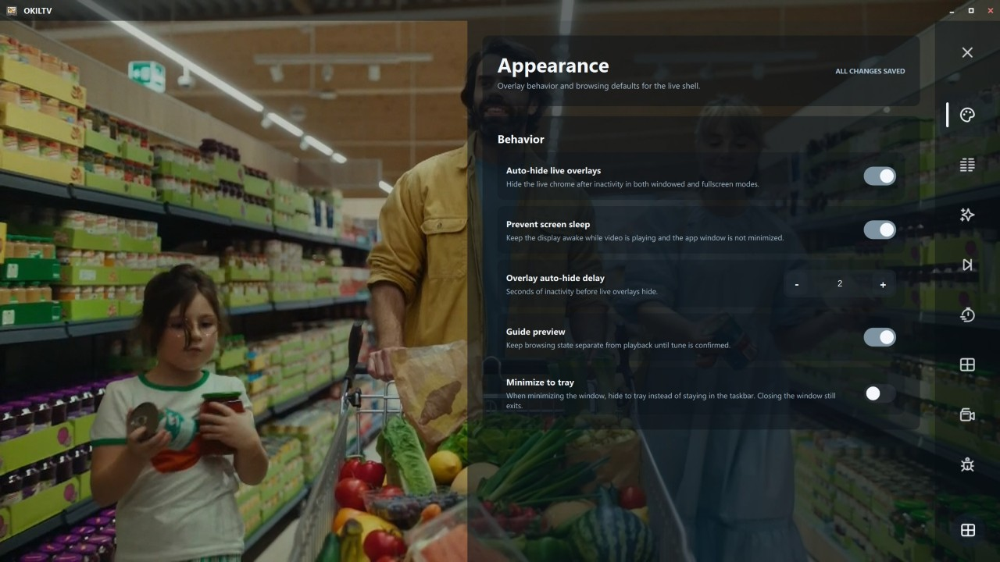
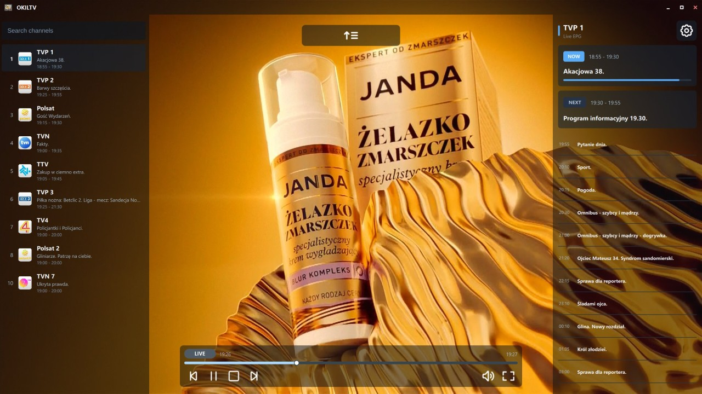
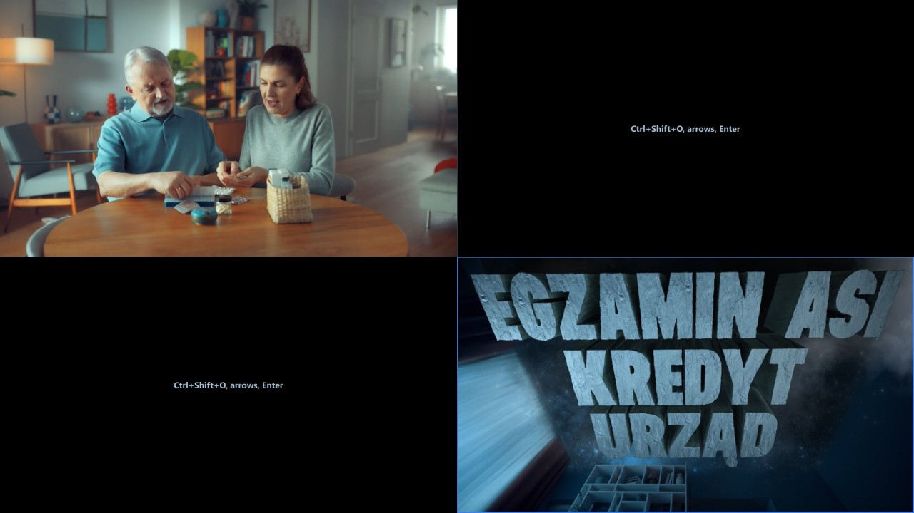

# OKILTV

<p align="center">
  
</p>

<p align="center">
  A desktop <strong>IPTV player</strong> built with Qt and libmpv.<br/>
  <small><em>No VOD support is planned for this app.</em></small><br/><br/>
  Current version: <strong>0.4.0</strong>
</p>

## Features

- **Live TV with EPG** - Watch IPTV channels and browse now/next/upcoming programme data.
- **Xtream + M3U Sources** - Add Xtream Codes providers, M3U URLs, or local M3U files.
- **Overlay-First UI** - Live video remains the base layer; Guide and Settings open as overlays.
- **Guide Timeline Navigation** - Move across channels and time in a continuous EPG grid.
- **Source/Group Management** - Per-profile group hide/show, ordering, and filtering.
- **Favourites Model** - Runtime favourites (watch-time based) plus manual pinning.
- **Catch-up** - Supports XC provider timeshift to watch past programme.
- **Local Timeshift** - Optional live buffer with seek-back, seek-forward, and jump-to-live. (requires _ffmpeg_ installed)
- **Recording + DVR** - Manual recording and programme-based DVR scheduling. (requires _ffmpeg_ installed)
- **PiP + Multiview** - Keep multiple live sessions and switch/swap quickly.
- **Keyboard-First Controls** - Full shortcut workflow for playback and navigation.

## Screenshots












## Installation

Download the latest build from the **Releases** page.

Expected Windows artifacts:

- `OKILTV-qt-win-x64-{version}.zip` -> just unzip and use
- `OKILTV-qt-win-x64-setup-{version}.exe` -> proper installer
- `OKILTV-qt-win-x64-portable-{version}.exe` -> portable version

_Windows SmartScreen may block the app on first run. Click **More info** → **Run anyway** to proceed._

Default version comes from `qt/CMakeLists.txt` (currently `0.4.0`). Override by exporting `APP_VERSION` before packaging.

| Platform | Notes |
|----------|-------|
| Windows | Prebuilt artifacts are packaged via repo scripts. |
| Linux | Build from source (native Linux flow below). |

## Quick Start

1. Open **Settings**.
2. Add a source profile (Xtream or M3U).
3. Add XMLTV URL (optional).
4. **Save** provider (_bottom right corner_).
5. Select **Groups** that you want.
6. **Refresh** channels and **Activate** source.

## Building from Source

### Prerequisites

- CMake 3.25+
- Ninja
- Qt 6.10+
- libmpv runtime _(you need to download mpv DLL and place it in `/build/mpv` directory as `mpv-2.dll`)_

Builds are preset-based via `CMakePresets.json` and write to `qt/out/build/<preset>`.

### Linux (Native)

Optional environment setup (recommended if system Qt is older than 6.10):

```bash
export QT_LINUX_SDK_ROOT=/opt/Qt/6.10.3/gcc_64
export PATH="$QT_LINUX_SDK_ROOT/bin:$PATH"
export CMAKE_PREFIX_PATH="$QT_LINUX_SDK_ROOT${CMAKE_PREFIX_PATH:+:$CMAKE_PREFIX_PATH}"
```

Debug:

```bash
cmake --fresh --preset qt-linux-debug
cmake --build --preset qt-linux-debug -j"$(scripts/build_jobs.sh)"
```

Release:

```bash
cmake --fresh --preset qt-linux-release
cmake --build --preset qt-linux-release -j"$(scripts/build_jobs.sh)"
```

One-command helper:

```bash
./build_linux.sh
```

### Windows Cross-Build (from Linux)

Set SDK paths (canonical defaults):

```bash
export QT_WIN_SDK_ROOT=/opt/Qt/6.10.3/mingw_64
export QT_HOST_PATH=/opt/Qt/6.10.3/gcc_64

cmake --fresh --preset qt-win64-release
cmake --build --preset qt-win64-release -j"$(scripts/build_jobs.sh)"
scripts/package_qt_win64.sh
```

End-to-end helper:

```bash
./build_windows.sh
```

Outputs (example version 0.4.0):

- `publish/OKILTV-qt-win-x64-0.4.0.zip`
- `publish/OKILTV-qt-win-x64-setup-0.4.0.exe`
- `publish/OKILTV-qt-win-x64-portable-0.4.0.exe`

To package with a different version, set `APP_VERSION` before running the packaging script or helper.

## Testing

### Standard Local Verification

```bash
cmake --fresh --preset qt-linux-debug
cmake --build --preset qt-linux-debug -j"$(scripts/build_jobs.sh)"
ctest --preset qt-linux-debug
cmake --build --preset qt-linux-debug --target qmllint_okiltv
scripts/run_clang_tidy_src.sh
```

Test binaries:
- `OKILTVQtCoreTests`
- `OKILTVQtAppTests`


## Keyboard Shortcuts

### Global / Live TV

| Key | Action |
|-----|--------|
| `Space` | Play/Pause |
| `J` / `L` | Timeshift/Catch-up seek back/forward 10 seconds |
| `Home` | Jump to buffered live anchor/live edge |
| `F` | Fullscreen (or favourite toggle in left-pane keyboard mode) |
| `F1` / `F2` | Open audio/subtitle track picker |
| `F3` | Toggle live debug bubble |
| `M` | Mute/Unmute |
| `,` / `.` | Volume down/up 5% |
| `Up` / `Down` | Prev/Next channel |
| `Backspace` | Return to previously played channel |
| `0-9` | Direct numeric tune (2s idle commit) |
| `Ctrl+Up` | Open Guide |
| `Ctrl+S` | Open source picker |
| `Ctrl+G` | Open group picker |
| `Ctrl+P` | Toggle PiP |
| `Ctrl+Shift+P` | Swap primary and PiP |
| `Ctrl+O` | Toggle multiview grid |
| `Ctrl+Shift+O` | Toggle multiview tile-selection mode |
| `Ctrl+Alt+O` | Fully exit multiview grid (if "Retain multiview" is enabled in Settings) |
| `Ctrl+R` | DVR schedule toggle (programme) or manual recording fallback |
| `Esc` | Stepwise close search/guide/overlay/fullscreen states |

<details>
<summary>Full keyboard reference</summary>

### Left-Pane Keyboard Navigation

| Key | Action |
|-----|--------|
| `Up` / `Down` | Move channel highlight (wraparound) |
| `Right` | Jump to right pane |
| `Return` | Tune highlighted channel |

### Right-Pane Keyboard Navigation

| Key | Action |
|-----|--------|
| `Up` / `Down` | Move programme highlight (no wraparound) |
| `Left` | Jump back to left pane |

### Multiview Selection Mode

| Key | Action |
|-----|--------|
| `Ctrl+Shift+O` | Enter/exit selection mode |
| Arrow keys | Move candidate border |
| `Enter` | Commit selected tile as active focus |
| `Esc` | Exit selection mode without changing active focus |

### Guide Overlay Keyboard

| Key | Action |
|-----|--------|
| Arrow keys | Navigate programme grid |
| `Space` | Toggle selected programme details |
| `Return` | Tune selected channel/Play Catch-up if available |
| `Ctrl+Down` | Collapse Guide to video-only |
| `Esc` | Close Guide + transient overlay state |

</details>

## Data Location

- Linux: app data under the platform-specific Qt writable app-data location
- Windows: app data under `%APPDATA%\\OKILTV`
- Portable launcher mode: supports runtime data-root override

## Disclaimer

This application is a media player client only and does not provide any channels or media content.<br>
Users must supply their own provider credentials and playlists.

Application was _vibe-coded_ using **Codex**.<br>
Only thing **made by real human** is application logo/icon, thank you **Sztylka**!

## Third-Party Credits

- **mpv** — Video playback engine used by the player: https://github.com/mpv-player/mpv
- **Dazzle Line Icons** — UI icon assets: https://dazzleui.pro/

## License

This project is licensed under **PolyForm Noncommercial 1.0.0**.

- Non-commercial use, modification, and forking are allowed under [LICENSE](LICENSE).
- Commercial use is **not** allowed under the public license. See [COMMERCIAL_LICENSE.md](COMMERCIAL_LICENSE.md) _(currently no commercial license is offered)_.
