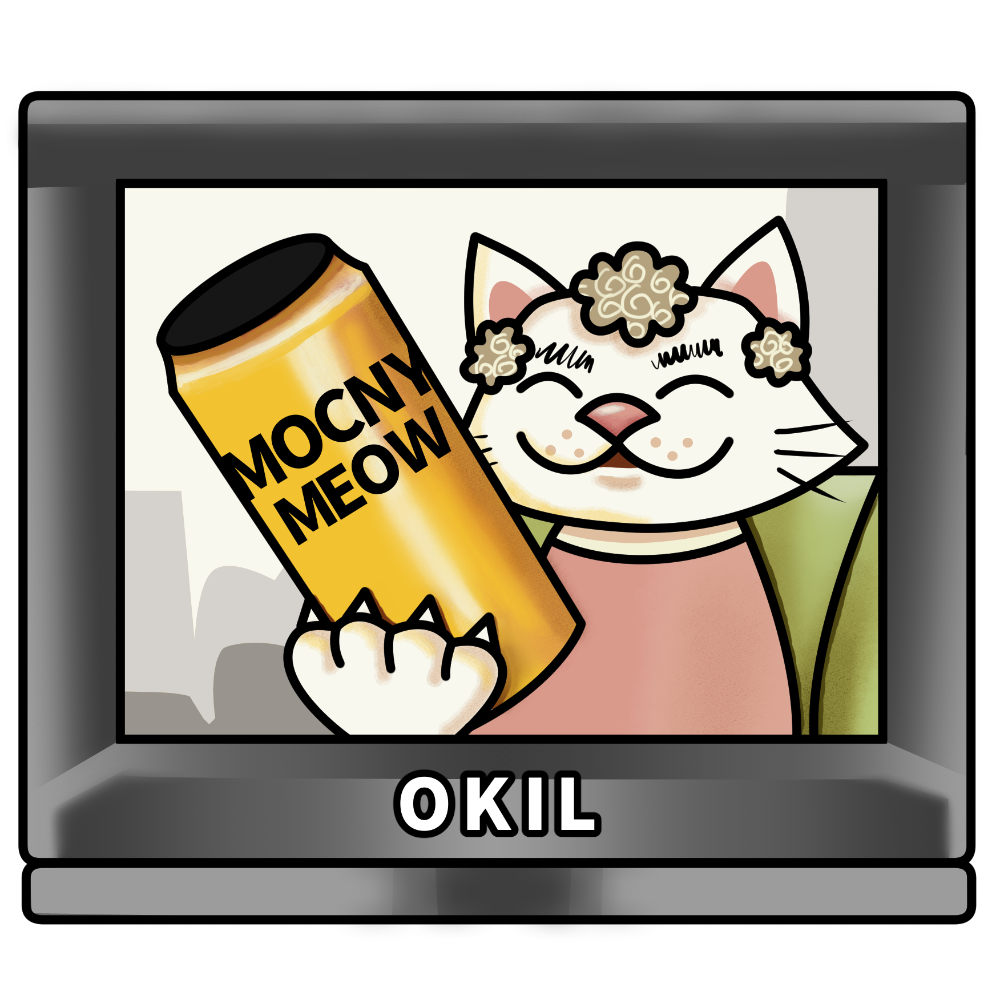
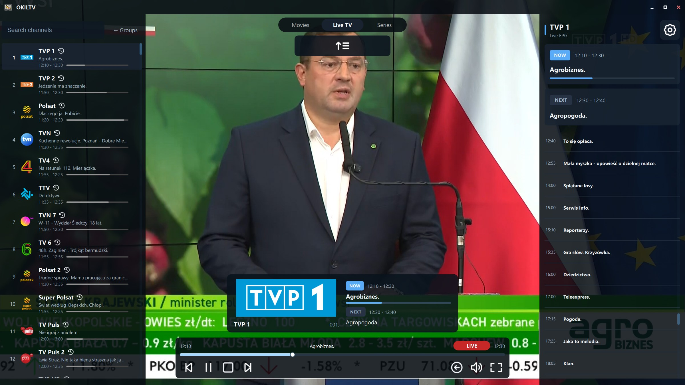
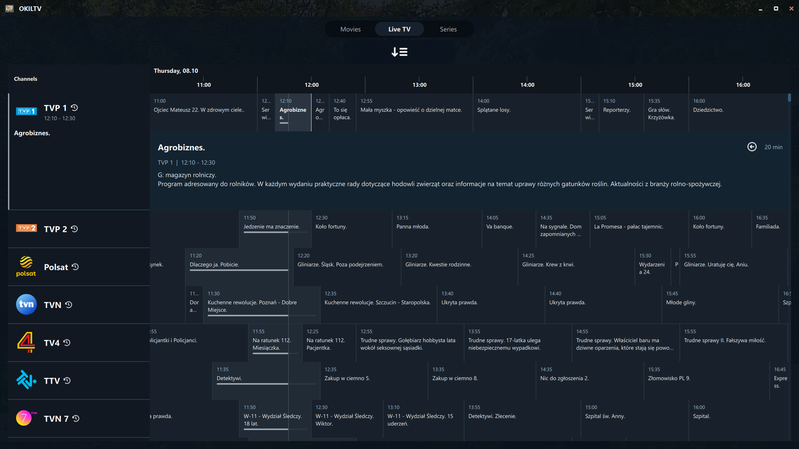
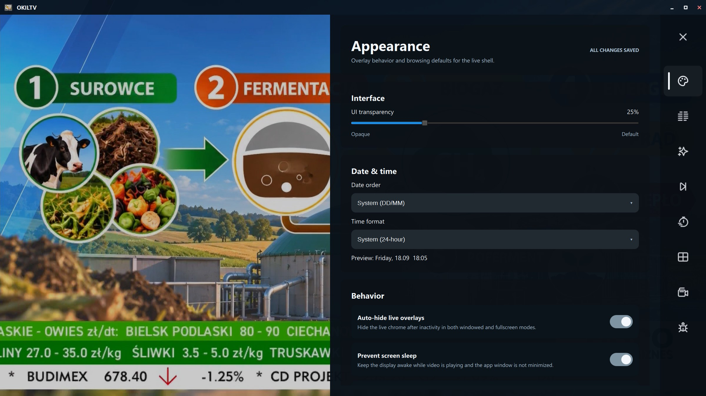
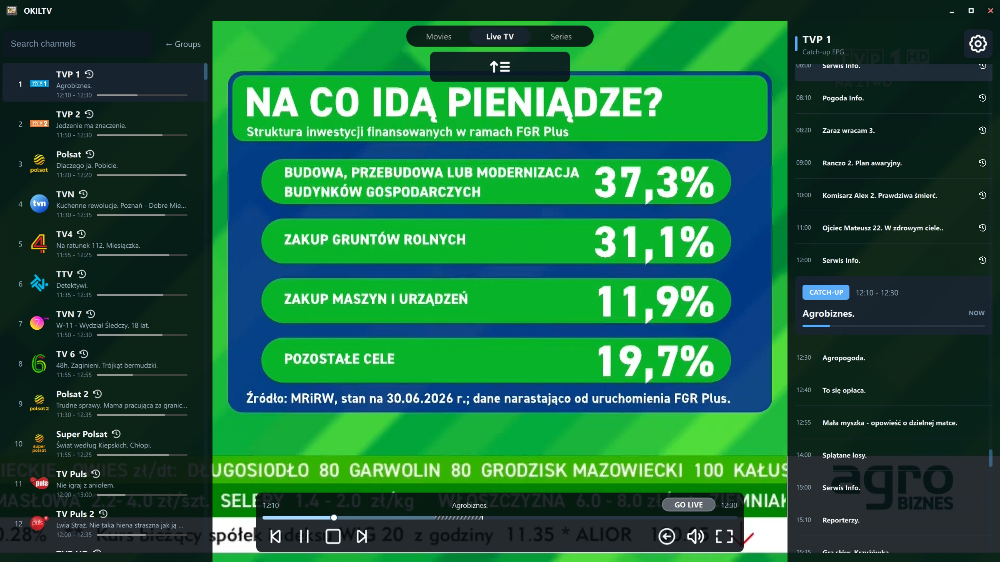
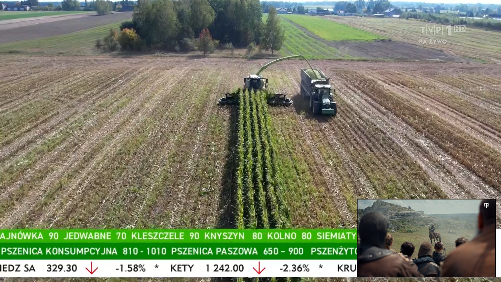
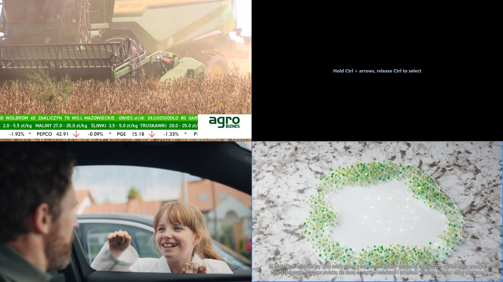
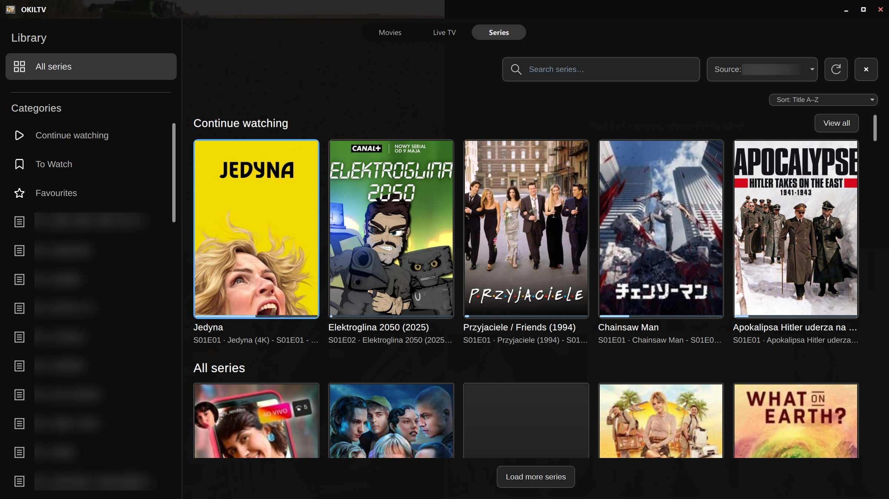
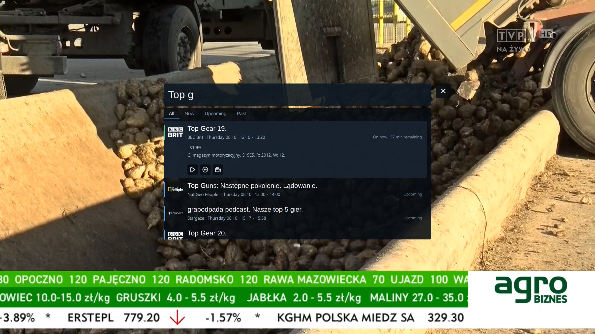

# OKILTV

<p align="center">
  
</p>

<p align="center">
  A desktop <strong>IPTV player</strong> built with Qt and libmpv.<br/>
  Current version: <strong>0.6.1</strong>
</p>


## Features

- **Live TV with EPG** - Watch IPTV channels and browse now/next/upcoming programme data.
- **VOD** - supports Movies and Series VOD from providers.
- **Xtream + M3U Sources** - Add Xtream Codes providers, M3U URLs, or local M3U files.
- **Overlay-First UI** - Live video remains the base layer; Guide and Settings open as overlays.
- **Guide Timeline Navigation** - Move across channels and time in a continuous EPG grid.
- **EPG Search** - Search your EPG data for anything.
- **Source/Group Management** - Per-profile group hide/show, ordering, and filtering.
- **Favourites Model** - Runtime favourites (watch-time based) plus manual pinning.
- **Catch-up** - Supports XC provider timeshift to watch past programme.
- **Local Timeshift** - Optional live buffer with seek-back, seek-forward, and jump-to-live. (requires _ffmpeg_ installed)
- **Recording + DVR** - Manual recording and programme-based DVR scheduling. (requires _ffmpeg_ installed)
- **PiP + Multiview** - Keep multiple live sessions and switch/swap quickly.
- **Keyboard-First Controls** - Full shortcut workflow for playback and navigation.

## Screenshots (as of version 0.6.1)

















## Installation

Download the latest build from the **Releases** page.

Expected Windows artifacts:

- `OKILTV-qt-win-x64-{version}.zip` -> portable build; unzip and run `OKILTV.exe`. Its settings, cache, and database stay in `data` beside the app.
- `OKILTV-qt-win-x64-setup-{version}.exe` -> proper installer

_Windows SmartScreen may block the app on first run. Click **More info** → **Run anyway** to proceed._

Default version comes from `qt/CMakeLists.txt` (currently `0.5.4`). Override by exporting `APP_VERSION` before packaging.

| Platform | Notes |
|----------|-------|
| Windows | Prebuilt artifacts are packaged via repo scripts. |
| Linux | Build from source (native Linux flow below). |

## Quick Start

1. Open **Settings**.
2. Add a source profile (Xtream or M3U).
3. Add XMLTV URL (optional).
4. **Save** provider (_bottom right corner_).
5. Select **Groups** that you want.
6. **Refresh** channels and **Activate** source.

## Building from Source

### Prerequisites

- CMake 3.25+
- Ninja
- Qt 6.10+
- libmpv runtime _(you need to download mpv DLL and place it in `/build/mpv` directory as `mpv-2.dll`)_

Builds are preset-based via `CMakePresets.json` and write to `qt/out/build/<preset>`.

### Linux (Native)

Optional environment setup (recommended if system Qt is older than 6.10):

```bash
export QT_LINUX_SDK_ROOT=/opt/Qt/6.10.3/gcc_64
export PATH="$QT_LINUX_SDK_ROOT/bin:$PATH"
export CMAKE_PREFIX_PATH="$QT_LINUX_SDK_ROOT${CMAKE_PREFIX_PATH:+:$CMAKE_PREFIX_PATH}"
```

Debug:

```bash
cmake --fresh --preset qt-linux-debug
cmake --build --preset qt-linux-debug -j"$(scripts/build_jobs.sh)"
```

Release:

```bash
cmake --fresh --preset qt-linux-release
cmake --build --preset qt-linux-release -j"$(scripts/build_jobs.sh)"
```

One-command helper:

```bash
./build_linux.sh
```

### Windows Cross-Build (from Linux)

Set SDK paths (canonical defaults):

```bash
export QT_WIN_SDK_ROOT=/opt/Qt/6.10.3/mingw_64
export QT_HOST_PATH=/opt/Qt/6.10.3/gcc_64

cmake --fresh --preset qt-win64-release
cmake --build --preset qt-win64-release -j"$(scripts/build_jobs.sh)"
scripts/package_qt_win64.sh
```

End-to-end helper:

```bash
./build_windows.sh
```

Outputs (example version 0.4.0):

- `publish/OKILTV-qt-win-x64-0.4.0.zip`
- `publish/OKILTV-qt-win-x64-setup-0.4.0.exe`

To package with a different version, set `APP_VERSION` before running the packaging script or helper.

## Testing

### Standard Local Verification

```bash
cmake --fresh --preset qt-linux-debug
cmake --build --preset qt-linux-debug -j"$(scripts/build_jobs.sh)"
ctest --preset qt-linux-debug
cmake --build --preset qt-linux-debug --target qmllint_okiltv
scripts/run_clang_tidy_src.sh
```

Test binaries:
- `OKILTVQtCoreTests`
- `OKILTVQtAppTests`


## Keyboard Shortcuts

Shortcuts depend on the active screen and keyboard focus. Search fields keep normal
text editing; Guide, Settings, libraries, pickers and dialogs own their input.
`Enter` below includes both Return and numeric-keypad Enter. `Ctrl+Tab` is unbound.

### Global / Live TV

| Key | Action |
|-----|--------|
| `V` / `B` | Toggle Movies / Series; the other key switches the open library |
| `Space` | Play/Pause the active stream (Live, catch-up, focused multiview tile or VOD) |
| `J` / `L` | Seek back/forward 10 seconds when available (timeshift, catch-up, live back-buffer or VOD) |
| `Home` | Jump to buffered live anchor/live edge when Live/catch-up transport seeking is available |
| `F` | Fullscreen (or favourite toggle in left-pane keyboard mode) |
| `F1` / `F2` | Open audio/subtitle track picker for the active stream |
| `F3` | Toggle live debug bubble |
| `F6` | Toggle always-on-top |
| `M` | Mute/Unmute |
| `,` / `.` | Volume down/up 5% |
| `Up` / `Down` | Prev/Next channel when overlays are hidden |
| `Backspace` | Return to previously played channel when overlays are hidden |
| `0-9` | Enter a Live channel number; tune after 2 seconds without input (outside editors, overlays and pickers) |
| `.` / locale decimal separator | While entering a channel number, enter its fractional part (e.g. `12.1`) |
| `Ctrl+Up` | Select tile above in grid; otherwise open Guide |
| `Left` / `Right` | Enter channel/programme pane keyboard navigation |
| `Tab` | Focus Live channel search; from that search, focus the Movies / Live TV / Series switch |
| `Ctrl+F` | Open local EPG title/subtitle search in Live TV; focus movie/series search in VOD |
| `Ctrl+S` | Open source picker |
| `Ctrl+G` | Open group picker |
| `Ctrl+P` | Toggle PiP |
| `Ctrl+Shift+P` | Swap primary and PiP |
| `Ctrl+O` | Open multiview; close an active grid and its secondary streams, or stop retained background streams |
| `Ctrl+Arrow` | Select grid tile while holding Ctrl; release Ctrl to confirm |
| `Ctrl+Enter` | Promote selected multiview tile and close grid, respecting retention |
| `Enter` | Tune the highlighted Live channel, or activate the programme in right-pane keyboard navigation |
| `Delete` | Close the focused PiP/grid tile |
| `Ctrl+D` | Download explicitly selected ended programme in Guide or the right EPG pane |
| `Ctrl+R` | Toggle DVR for the selected/hovered programme; otherwise toggle manual recording |
| `Esc` | Cancel grid selection, close a picker/overlay or dismiss playback chrome; exit fullscreen once transient UI is closed (see VOD behavior below) |

V/B are disabled in text editors, Settings and modal interactions. Opening a library
pauses active VOD; closing it resumes only the same session paused by the library.
An existing manual pause is preserved. Live TV playback continues while browsing.

### Live programme search validation

The local EPG UI scenario uses generated media and an isolated XMLTV fixture. Run the
main routing, focus and responsive-layout checks with:

```bash
ctest --preset qt-linux-debug -R '^UI-14-epg-search$' --output-on-failure
```

Additional isolated smoke modes cover PiP/grid preservation, a source without EPG
and the explicit 256-character query limit (`extended`), 200% scaling (`scale`),
and the first import's Preparing-to-results transition using a delayed local XMLTV
response (`preparing`). Each run retains bridge checks, logs and screenshots:

```bash
OKILTV_EPG_SEARCH_SMOKE=extended bash scripts/ci/run_ui_test.sh ui-tests/tests/14-epg-search.py qt/out/build/qt-linux-debug/app/OKILTV qt/out/build/qt-linux-debug/ui-artifacts/14-epg-search-extended
QT_SCALE_FACTOR=2 OKILTV_EPG_SEARCH_SMOKE=scale bash scripts/ci/run_ui_test.sh ui-tests/tests/14-epg-search.py qt/out/build/qt-linux-debug/app/OKILTV qt/out/build/qt-linux-debug/ui-artifacts/14-epg-search-scale200
OKILTV_EPG_SEARCH_SMOKE=preparing bash scripts/ci/run_ui_test.sh ui-tests/tests/14-epg-search.py qt/out/build/qt-linux-debug/app/OKILTV qt/out/build/qt-linux-debug/ui-artifacts/14-epg-search-preparing
```

### Mouse Shortcuts

| Button | Action |
|--------|--------|
| `LMB` | Select a channel; double-click to start playback |
| `MMB` | Toggle the channel's favourite status |
| `RMB` | Open or update the channel in PiP |

<details>
<summary>Full keyboard reference</summary>

### Left-Pane Keyboard Navigation

| Key | Action |
|-----|--------|
| `Up` / `Down` | Move channel highlight (wraparound) |
| `Left` | Open group picker |
| `Right` | Jump to right pane |
| `Enter` | Tune highlighted channel and dismiss playback chrome |
| `F` | Toggle highlighted channel's favourite status |

From the channel search field, Down/Enter focuses the channel list. Tab enters the
media switch when available; its Left/Right keys choose a segment, Enter/Space
activates it, and Esc returns focus to playback.

### Source, Group and Track Pickers

| Key | Action |
|-----|--------|
| `Down` / `Tab` / `Enter` in source/group search | Focus the first result |
| `Up` / `Down` | Move the highlighted source, group or track |
| `Enter` | Confirm the highlighted source, group or track |
| `Right` in group list | Confirm the group and return to channels/movies/series without starting playback |
| `Delete` in VOD subtitle picker | Remove the highlighted uploaded subtitle file |
| `Esc` | Close the picker |

### Right-Pane Keyboard Navigation

| Key | Action |
|-----|--------|
| `Up` / `Down` | Move programme highlight (no wraparound) |
| `Left` | Jump back to left pane |
| `Enter` | Resume eligible catch-up for a completed programme, or tune the channel for NOW/future |
| `Ctrl+D` | Download the explicitly selected ended programme, when eligible |
| `Ctrl+R` | Toggle selected/hovered programme DVR; otherwise toggle manual recording |

Unavailable archives do not fall back to Live TV in this pane.

### Multiview Selection Mode

| Key | Action |
|-----|--------|
| `Ctrl+Arrow` | Start grid selection on the first arrow; move orange candidate border with edge wrap |
| Release `Ctrl` | Commit candidate as active tile and audio owner |
| `Ctrl+Enter` | Promote the candidate (or active tile) to main view and close the grid; retain other streams only when enabled |
| `Ctrl+O` | Fully close the grid or stop retained background streams; next press opens a new grid |
| `Delete` | Close the focused tile |
| `Esc` | Cancel without changing active tile or audio |

This gesture is grid-only; PiP tiles remain selectable with the mouse. Ctrl alone does nothing.
Empty tiles remain selectable and held arrows repeat. Only Ctrl without Shift/Alt/Meta activates the gesture.
Guide, Settings, search fields, pickers and dialogs retain their own keyboard handling.
In ordinary Live panels the gesture takes priority over Ctrl+Up opening Guide and hides shell chrome.
Selection keeps focus on `interactionFocusTarget`, shows a 3px orange candidate border and the
“Ctrl + arrows  Release Ctrl to select / Ctrl+Enter to promote / Esc to cancel” hint.
Ctrl+Enter commits and promotes the candidate without first releasing Ctrl. A plain Enter is ignored while selecting.
Promotion of an empty tile does nothing. Ctrl+O cancels the candidate and keeps the previously committed stream.
Window/focus loss, layout changes, opening a protected context, or another recognized shortcut
cancel the candidate; cancellation never steals focus.
Clicking a tile cancels the candidate before the normal mouse selection.
Ctrl+Shift+O and Ctrl+Alt+O are unbound. Both main and numeric Enter support promotion.
After promotion with retention, Ctrl+O stops only background streams; another press opens a fresh grid.

Transport controls, Space, channel stepping, and playback EPG follow the committed focused tile. Browsing other channels does not change the transport target. Empty tiles have no playback EPG; Space is a no-op. Focus changes preserve each stream and its pause state.

Focus-border contract:
- PiP shows no blue/orange focus border on either tile.
- Grid focused tile uses a 2px blue border when not selecting.
- Grid selection uses a 3px orange border on the candidate tile.

### Guide Overlay Keyboard

| Key | Action |
|-----|--------|
| Arrow keys | Navigate programme grid |
| `Space` | Toggle selected programme details |
| `Enter` | Play catch-up for an eligible completed programme; otherwise tune selected channel |
| `Ctrl+Enter` | Start selected eligible programme in catch-up from the beginning |
| `Ctrl+D` | Download selected ended programme |
| `Ctrl+R` | Toggle selected/hovered programme DVR; otherwise toggle manual recording |
| `Ctrl+Down` | Collapse Guide to video-only |
| `Esc` | Close Guide + transient overlay state |

### Live EPG Search

| Key | Action |
|-----|--------|
| `Ctrl+F` | Focus the query field |
| `Up` / `Down` in query/results | Select the previous/next result |
| `Tab` | Cycle time filters: All → Now → Upcoming → Past → All |
| `Shift+Tab` | Move focus backwards between search controls and available result actions |
| `Enter` in query/results | Activate the selected result's available Live/catch-up action |
| `Ctrl+Enter` | Play eligible catch-up from the beginning; otherwise use the available primary playback action |
| `Ctrl+R` | Toggle DVR for the selected programme |
| `Ctrl+D` | Download the selected ended programme, when eligible |
| `Esc` | Close EPG search and return focus to playback |

### Movies / Series Library

| Key | Action |
|-----|--------|
| `V` / `B` | Close the matching library, or switch to Movies / Series |
| `Ctrl+F` | Focus title search while browsing posters |
| Arrow keys in poster grid | Move poster selection |
| `Home` / `End` in poster grid | Select the first/last poster in the loaded grid |
| `Left` / `Right` on Continue watching shelf | Select the previous/next poster without wrapping |
| `Down` on shelf / `Up` in first grid row | Move between the shelf and poster grid |
| `Enter` on poster | Open details |
| `Up` / `Down` in series details episode list | Select the previous/next episode without wrapping |
| `Left` / `Right` in series details episode list | Change season without wrapping and select its first episode |
| `Enter` in episode list | Play/resume the selected episode when available |
| `Tab` / `Shift+Tab` | Move focus between controls |
| `Delete` in subtitle selector | Remove the selected uploaded subtitle file |
| `Esc` | Close an open selector, return from details to posters, then close the library |

### VOD Playback

| Key | Action |
|-----|--------|
| `Space`, `J` / `L`, `F`, `M`, `,` / `.` | Play/pause, seek ±10 seconds, fullscreen, mute and volume ±5% |
| `F1` / `F2` / `F3` / `F6` | Audio picker, subtitle picker, debug bubble and always-on-top |
| `Tab` / `Ctrl+F` | Focus movie/series search; Tab from search enters the media switch when available |
| `Down` / `Enter` in search | Focus the movie/series list |
| `Left` | Focus the movie/series list; another Left from that list opens its groups |
| `Right` | Show movie information or focus the series episode list |
| `Up` / `Down` in list | Select a movie/series or episode without starting playback |
| `Enter` in list | Play/resume the selected movie/series or episode |
| `Esc` | Close an open season selector or track picker, then dismiss visible chrome; with chrome hidden, stop/checkpoint VOD and return to its library/details |
| `Backspace` with chrome hidden | Stop/checkpoint VOD and return to the movie library or owning series details |

Search Backspace keeps normal text editing. In the playback episode panel, Left
returns to the series list; change seasons with its selector. Live numeric tuning,
Guide, recording and multiview shortcuts do not control VOD playback.

</details>

## Data Location

- Linux: app data under the platform-specific Qt writable app-data location
- Windows installer: app data under `%APPDATA%\\OKILTV`
- Windows ZIP: app data under `data` beside `OKILTV.exe`; the Portable settings panel can override that location.

## Disclaimer

This application is a media player client only and does not provide any channels or media content.<br>
Users must supply their own provider credentials and playlists.

Application was _vibe-coded_ using **Codex**.<br>
Only thing **made by real human** is application logo/icon, thank you **Sztylka**!

## Third-Party Credits

- **mpv** — Video playback engine used by the player: https://github.com/mpv-player/mpv
- **Dazzle Line Icons** — UI icon assets: https://dazzleui.pro/

## License

This project is licensed under **PolyForm Noncommercial 1.0.0**.

- Non-commercial use, modification, and forking are allowed under [LICENSE](LICENSE).
- Commercial use is **not** allowed under the public license. See [COMMERCIAL_LICENSE.md](COMMERCIAL_LICENSE.md) _(currently no commercial license is offered)_.
